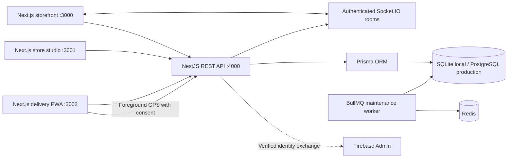

# Daybasket architecture

This implementation is the first vertical slice from the brief. The old QuickCart files and database remain in place and are not used or migrated by Daybasket.

## Boundaries

All clients use REST through `packages/api-client`. Frontends never import Prisma or query the database. Shared Zod request schemas are in `packages/types`; the API parses untrusted bodies before constructing explicit Prisma inputs. The React design system uses Radix Dialog for focus management, dismissal and accessible dialog semantics. Tailwind is configured with a shared original CSS design system. Nest has an API controller, database service, auth service, domain functions, tracking adapter and provider adapters. The large controller should be split into the full domain modules as the next phases grow; the requested full module list is not implemented yet.

## Data and invariants

- `User` → `Session`, `Address`, `CartItem`, `Wishlist`, `Order`.
- `Store` ↔ `Product` through unique per-store `Inventory`.
- `Category` → `Product`. One pack variant per product in this slice.
- `Order` → immutable price/name snapshots in `OrderItem`, append-only `OrderHistory`, GPS `LocationSample`.
- `InventoryMovement` and `AuditLog` record stock and privileged changes within the same transaction.
- `Coupon` stores basis-point discounts, integer minimum and cap.
- `WebhookEvent` is a future replay-protection entity; no live webhook ingestion is exposed yet.

Amounts are integer paise. Inclusive GST is extracted with rounding, never added to the displayed item price again. Promotions are capped and applied on the server. Shipping is ₹29 below ₹499; handling is ₹5; minimum order is ₹99. `HELLO10` takes 10% off baskets of at least ₹299, capped at ₹100. This development coupon is reusable, not first-order restricted.

A serializable transaction validates product availability and maximum purchase quantity, conditionally decrements available stock, increments sold stock, creates the order and immutable lines, records movements and clears the account cart. An order cannot commit if any line fails. The unique `(userId, idempotencyKey)` constraint prevents duplicate orders; a hash rejects different requests using the same key. Cancellation uses a conditional status update in a transaction, so stock cannot be restored twice. Immediate COD/mock checkout does not need a pending-payment reservation; real delayed online payments will require expiring reservations before being exposed.

## Authorization and tracking

Sessions use 256-bit opaque random tokens. Only SHA-256 token hashes are stored. Cookies are HttpOnly, SameSite=Lax and Secure in production. CORS and mutating-request Origin validation restrict browsers to configured frontends. Roles implemented: customer, super_admin, delivery. Firebase ID tokens are verified with revocation checking and exchanged for the server session. Firebase-linked accounts do not automatically obtain privileged roles.

Socket connections authenticate a session. Every room subscription rechecks both the session and order ownership/assignment. Broadcasts contain only an order ID invalidation: clients fetch authorized details by REST. Sessions are periodically revalidated. Drivers can post GPS only for their assigned order while out for delivery/arriving. Customers and unrelated drivers cannot access each other's tracking data. Order delivery code hashes are stripped from responses; only the owning customer receives the code. Admin/driver cannot retrieve the code. Actual coordinates are never interpolated or animated. A ten-second REST fallback is always active.

Browser background GPS is not reliable. Closing/locking/hiding a mobile browser can suspend location. The partner PWA deliberately tells drivers to keep the app foregrounded and offers explicit stop sharing. The REST location contract is usable by a later native app. API and worker processes shut down on SIGTERM; the worker prunes expired sessions and raw GPS samples.

## Development constraints

The serviceability calculation supports active stores with configurable radius and selects the nearest eligible store. The catalogue currently uses the seeded Indiranagar store; opening hours, capacity, polygons and dynamically selected inventory/prices remain future work. OTP challenges and rate limiting are process-local. Do not scale this API horizontally until they are moved to Redis. Production migration includes PostGIS, but radius checks currently use the tested Haversine domain function. A production PostgreSQL execution has not yet been verified on this machine.
